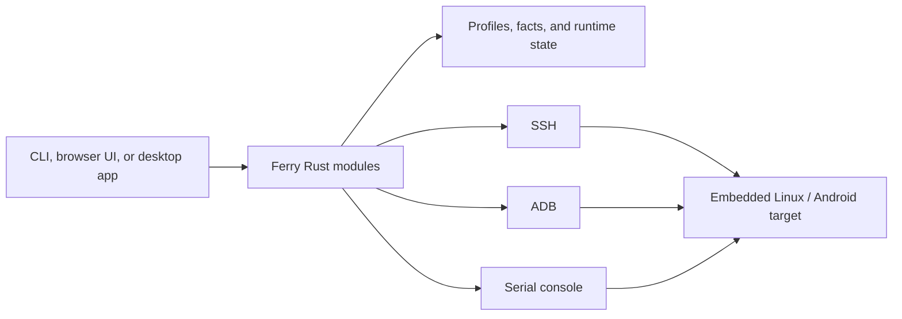

# Architecture

Ferry deliberately keeps the stable operational model in the Rust core, then exposes it through a CLI and two interactive clients. This avoids making the desktop or browser UI the source of truth for device behaviour.

## Core and state

The root crate is intentionally dependency-free: the core uses Rust's standard library and orchestrates host tools such as `ssh`, optional `adb`, `rsync`, and `stty`. `src/main.rs` owns CLI dispatch and global flags; `src/lib.rs` exposes the reusable modules needed by the native desktop client.

Local state is scoped under `~/.config/ferry/`:

| Location | Responsibility |
| --- | --- |
| `devices.toml` | Saved transport/profile settings |
| `facts/` | Observed identity and hardware facts |
| `state.toml` | Managed forwards, shares, black boxes, and watcher state |
| `plugins/` | Explicitly installed local plugin packages |

Profiles have a user-chosen name and a primary transport. The name is the durable handle used by operations. Transport-specific resolution can reselect a live ADB serial after a USB topology change, while saved facts help avoid silently redirecting a pinned device to another target.

## Modules and responsibility boundaries

| Area | Primary modules | Responsibility |
| --- | --- | --- |
| Profiles and identity | `config.rs`, `fingerprint.rs`, `adbx.rs` | Persist profiles; capture and compare observed facts; resolve ADB selectors safely |
| Discovery | `scan.rs`, `mdns.rs` | Bounded discovery with protocol-level verification before offering a candidate |
| SSH and serial | `sshx.rs`, `serialx.rs`, `pty.rs` | Process construction, compatibility options, consoles, and pseudo-terminal ownership |
| Data movement | `xfer.rs`, `sync.rs`, `hash.rs`, `runx.rs` | Resume/verify transfer, sync, deploy/run/debug, and checksums |
| Connectivity | `fwd.rs`, `watchd.rs`, `share.rs`, `proxyd.rs`, `usbnet.rs`, `netdiag.rs` | Forwards, reconnection, proxy/NAT sharing, USB networking, and diagnostics |
| Evidence and recovery | `blackbox.rs`, `hwprobe.rs`, `peripheral_brief.rs`, `up.rs` | Serial incident capture, read-only hardware reports, and serial-to-network promotion |
| Interactive protocols | `ui.rs`, `wsutil.rs`, `httpd.rs`, `serve.rs` | Browser workbench, PTY WebSocket framing, local HTTP surfaces |
| Extensibility | `plugins.rs` | Manifest parsing, path safety, preflight plan, and local plugin lifecycle |

The key rule is that a module should not infer a stronger claim than its evidence. A reachable TCP port does not by itself prove a usable target; a USB path is not automatically the ADB serial reported by `adb devices`; a profile change should not silently choose a different board.

## Transports

### SSH

SSH profiles retain host, port, user, identity-file, legacy-algorithm, host-key, and connection-reuse settings. They are used consistently by shell, transfer, forwarding, sysroot sync, and other SSH workflows. Key authentication is preferred; password storage is a compatibility path rather than an ideal default.

### ADB

ADB operations resolve the selected device before each action. Ferry can anchor a port-invariant identity separately from a USB-sensitive serial, then reselect a live serial when a known device moves to another USB port. Network ADB is distinguished from a `usb:` selector rather than inferred from the presence of a colon.

### Serial

Serial is both an access path and a recovery instrument. A black-box daemon can own a serial port continuously and share an interactive attachment through a Unix socket. This prevents an ordinary shell session from stealing the port during incident collection.

## Interactive clients

### Browser workbench

`fy ui` serves a local browser UI on loopback by default. Its PTY bridge is a dedicated WebSocket endpoint. The server does not release startup input until a PTY writer exists; the client queues input until it receives an explicit ready message. This matters because a WebSocket handshake alone does not mean a child PTY is ready to receive bytes.

### Tauri desktop workbench

The native client is in `desktop/` and is built with Tauri, React, and xterm.js. It imports the Ferry Rust crate directly rather than duplicating transport logic. Its terminal endpoint is independent of the browser workbench, though it follows the same readiness and ordered-input rules. The client provides fleet, discovery, profile, terminal, operations, and plugin views; potentially disruptive guided workflows generate a plan before an explicit execute action.

The desktop app deliberately keeps sensitive boundaries narrow:

- interactive terminal prompts remain inside the PTY rather than being copied into general UI state;
- desktop plugins do not receive a saved SSH password and use SSH key authentication only;
- a `sudo` plugin destination requires a pre-authorised local `sudo -v` session because a background app cannot safely collect a host password;
- plugin package source is local and visible for review before installation.

## Extension packages

A local plugin package is a directory with a `plugin.toml` manifest and declared entrypoint. The core validates package paths, reads the manifest, exposes its risk and preview, then executes only after installation and command-level confirmation. Bundled packages provide sysroot mirroring and device-tree collection; they are installed explicitly rather than enabled silently.

## Change checklist

When modifying Ferry, consider these questions:

1. Which transport(s) can perform this operation, and what evidence proves the selected target is correct?
2. Does it modify the host, target, or both? Is there a preflight and rollback path?
3. Does its output preserve the JSON contract if it supports `--json`?
4. Does it cross a PTY, WebSocket, or external-process boundary that needs integration coverage?
5. Does the user-facing documentation describe prerequisites, side effects, and a safe first command?
