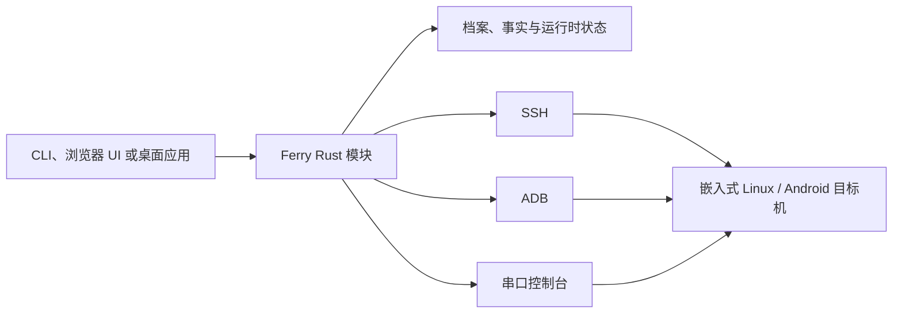

# 架构说明

Ferry 有意将稳定的操作模型放在 Rust 核心中，再通过 CLI 和两个交互式客户端开放出来。这样桌面端或浏览器 UI 都不会成为设备行为的事实来源。

## 核心与状态

根 crate 刻意保持零第三方依赖：核心只使用 Rust 标准库，并编排 `ssh`、可选的 `adb`、`rsync` 和 `stty` 等主机工具。`src/main.rs` 负责 CLI 分发与全局旗标；`src/lib.rs` 暴露原生桌面客户端需要复用的模块。

本地状态位于 `~/.config/ferry/`：

| 位置 | 职责 |
| --- | --- |
| `devices.toml` | 已保存的通道和档案设置 |
| `facts/` | 已观察到的身份与硬件事实 |
| `state.toml` | 受管转发、借网、黑匣子和守护进程状态 |
| `plugins/` | 显式安装的本地插件包 |

档案由用户选择的名称和主通道组成。名称是各类操作使用的持久句柄。通道特有的解析逻辑可以在 USB 拓扑变化后重新选择在线 ADB serial；保存的事实可协助避免把已固定的设备静默重定向到另一块板子。

## 模块与职责边界

| 领域 | 主要模块 | 职责 |
| --- | --- | --- |
| 档案与身份 | `config.rs`、`fingerprint.rs`、`adbx.rs` | 保存档案；采集和比较已观察事实；安全解析 ADB 选择器 |
| 设备发现 | `scan.rs`、`mdns.rs` | 受限发现；在提供候选项前做协议级验证 |
| SSH 与串口 | `sshx.rs`、`serialx.rs`、`pty.rs` | 进程构造、兼容性选项、控制台和伪终端所有权 |
| 数据移动 | `xfer.rs`、`sync.rs`、`hash.rs`、`runx.rs` | 可续传/可验证传输、同步、部署/运行/调试和校验和 |
| 连通性 | `fwd.rs`、`watchd.rs`、`share.rs`、`proxyd.rs`、`usbnet.rs`、`netdiag.rs` | 转发、重连、代理/NAT 借网、USB 配网和网络诊断 |
| 证据与恢复 | `blackbox.rs`、`hwprobe.rs`、`peripheral_brief.rs`、`up.rs` | 串口事故采集、只读硬件报告与串口升格 |
| 交互协议 | `ui.rs`、`wsutil.rs`、`httpd.rs`、`serve.rs` | 浏览器工作台、PTY WebSocket 帧和本地 HTTP 服务 |
| 可扩展性 | `plugins.rs` | 清单解析、路径安全、预检计划和本地插件生命周期 |

最重要的原则是：模块不应基于不足的证据推导出更强的结论。一个可达的 TCP 端口本身不能证明目标机可用；一个 USB 路径不必然是 `adb devices` 报告的 serial；更新档案时不应静默选择另一台开发板。

## 三种通道

### SSH

SSH 档案保留主机、端口、用户、身份文件、旧算法、主机密钥和连接复用设置。这些设置会一致地应用于 shell、传输、转发、sysroot 同步和其他 SSH 工作流。应优先使用密钥认证；密码保存只是兼容路径，而非理想默认值。

### ADB

ADB 每次操作前都会解析所选设备。Ferry 可以把不随 USB 端口变化的身份锚定为独立信息，再在已知设备换 USB 口时重新选择在线 serial。网络 ADB 与 `usb:` 选择器会被明确区分，而不是仅根据冒号是否存在来判断。

### 串口

串口既是访问路径，也是恢复工具。黑匣子守护进程可以持续持有串口，并通过 Unix socket 分享交互式附着。这能避免普通 shell 会话在事故采集期间抢占串口。

## 交互客户端

### 浏览器工作台

`fy ui` 默认只在 loopback 上提供本地浏览器 UI。它的 PTY 桥是独立 WebSocket 端点。服务端在 PTY 写端就绪前不会放行启动输入；客户端也会在收到明确的 ready 消息前排队输入。这一点很重要：WebSocket 握手完成并不代表子 PTY 已经能接收字节。

### Tauri 桌面工作台

原生客户端位于 `desktop/`，使用 Tauri、React 和 xterm.js 构建。它直接引入 Ferry Rust crate，而不是复制一套通道逻辑。它的终端端点与浏览器工作台相互独立，但遵循同样的就绪和有序输入规则。客户端提供设备总览、发现、档案、终端、操作和插件视图；可能造成影响的向导型工作流会先生成计划，随后才允许显式执行。

桌面应用有意收紧敏感边界：

- 交互式终端提示保留在 PTY 内，不会复制进通用 UI 状态；
- 桌面插件不会接收保存的 SSH 密码，只使用 SSH 密钥认证；
- 使用 `sudo` 的插件目标路径需要本地先通过 `sudo -v` 授权，因为后台应用不能安全地收集主机密码；
- 插件包源码位于本地，安装前可见、可审查。

## 扩展包

一个本地插件包是包含 `plugin.toml` 与声明入口的目录。核心会验证包路径、读取清单、公开风险与预览，并且只会在安装和命令级确认之后执行。内置包提供 sysroot 镜像和设备树采集；它们必须显式安装，而不会静默启用。

## 修改检查清单

修改 Ferry 时，请考虑以下问题：

1. 这个操作支持哪些通道？什么证据能证明选中的是正确目标机？
2. 它会改变主机、目标机还是两者？是否有预检和回滚路径？
3. 若它支持 `--json`，输出是否仍遵守 JSON 合约？
4. 它是否跨越 PTY、WebSocket 或外部进程边界，因而需要集成覆盖？
5. 面向用户的文档是否说明了前置条件、副作用和安全的第一步？
